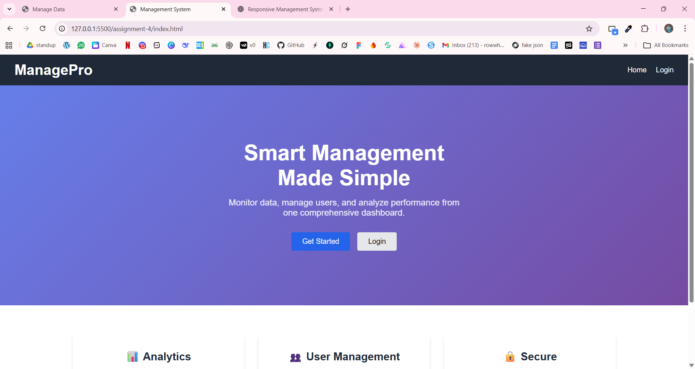
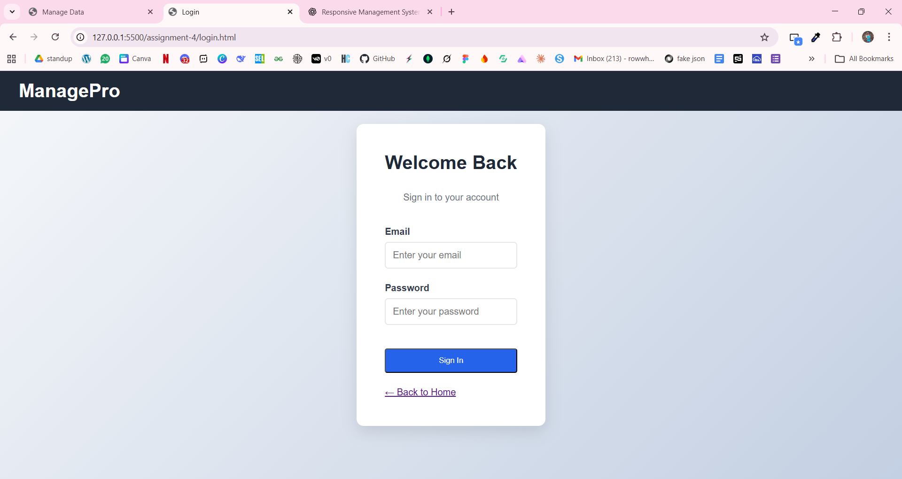
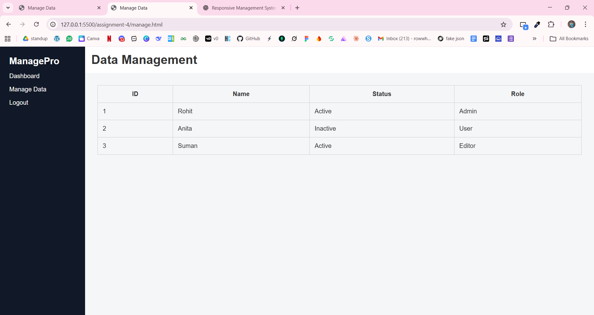

# ManagePro – Responsive Management System Interface

## Description
ManagePro is a responsive front-end management system interface designed using advanced HTML5 and CSS3 techniques. The project simulates a real-world admin panel experience.

## Pages
- Landing Page
- Login Page
- Dashboard Page
- Data Management Page

## Technologies Used
- HTML5
- CSS3 (Flexbox, Grid, Media Queries, Animations)

## Features
- Responsive layout for mobile, tablet, and desktop
- Sticky sidebar and header
- Grid-based dashboard
- Animated cards and hover transitions

## Screenshots

### Landing Page

### Login Page

### Dashboard Page

### Data Management Page

## Author
Rohit Tandukar
